# 🔄 PolySwap

**Automated DeFi swaps triggered by prediction market outcomes on Polygon**

PolySwap is a decentralized application that enables users to create conditional swap orders that execute automatically when specific prediction market outcomes are resolved. Built on top of CoW Swap's conditional order framework, PolySwap bridges the gap between prediction markets and DeFi trading.

## 🎯 What Is PolySwap?

PolySwap allows you to:

- **🎲 Create Conditional Orders**: Set up token swaps that only execute when your predicted market outcome occurs
- **📊 Browse Markets**: Explore Polymarket prediction markets directly in the interface
- **⚡ Automatic Execution**: Orders execute automatically when market conditions resolve in your favor
- **🔒 Trustless**: Built on CoW Swap's proven conditional order infrastructure
- **💸 Gas Efficient**: Leverages batch auctions and off-chain order matching

### Example Use Case

> *"I believe if Trump win the 2024 election, crypto market will go up. If 70% of people think he will wins, I want to automatically swap 1000 USDC for ETH at current market rates."*

With PolySwap, you can create this conditional order that will only execute if the condition is met, eliminating the need to manually monitor the election outcome and execute the trade yourself.

## 🏗️ Architecture Overview

PolySwap consists of two main components:

### 🖥️ Frontend (Next.js)
- **Modern React Interface**: Built with Next.js 15 and React 19
- **Market Browser**: Search and explore Polymarket prediction markets
- **Order Creation**: Intuitive interface for setting up conditional swaps
- **Order Management**: Track and manage your active conditional orders
- **Wallet Integration**: Wallet connection with Wagmi.sh and Privy

### ⚙️ Backend (Node.js + TypeScript)
- **RESTful API**: Serves market data and order information
- **Blockchain Listener**: Monitors Polygon for PolySwap order events
- **PostgreSQL Database**: Stores market data and order history
- **Real-time Processing**: Indexes and processes orders as they're created

📚 **[View Detailed Backend Documentation with API endpoints →](./Backend.md)**

## 🚀 Quick Start

### Prerequisites

- Node.js 18+ and npm
- Docker and Docker Compose (for the database)

### Installation

```bash
# Install dependencies
npm install

# Set up environment variables
cp .env.example .env
# Edit .env with your configuration
```

### Running the Application

1. **Start the database**:
   ```bash
   npm run db:up
   ```

2. **Start the backend services**:
   ```bash
   # Terminal 1: API Server
   npm run start:api
   
   # Terminal 2: Blockchain Listener
   npm run start:listener
   ```

3. **Start the frontend**:
   ```bash
   npm run dev
   ```

4. **Access the application**:
   - Frontend: `http://localhost:8080`
   - API: `http://localhost:3000`

## 🔧 Available Scripts

### Frontend Development
```bash
npm run dev          # Start Next.js development server
npm run build        # Build production frontend
npm run start        # Start production frontend
npm run lint         # Run ESLint
```

### Backend Services
```bash
npm run start:api                    # Start API server
npm run start:listener               # Start blockchain listener + market updater
npm run start:listener-only          # Start only blockchain listener
npm run start:market-updater         # Start only market updater (via listener)
npm run start:market-updater-standalone # Start standalone market updater
```

### Market Data Management
```bash
npm run saveMarkets   # Fetch markets from Polymarket API to data.json
npm run db:import     # Import markets from data.json to database
```

### Database Management
```bash
npm run db:up         # Start PostgreSQL container
npm run db:down       # Stop PostgreSQL container
npm run db:logs       # View database logs
npm run db:import     # Import market data
```

### Data Management
```bash
npm run saveMarkets   # Fetch latest market data from Polymarket
```

## 🔄 Automatic Market Updates

PolySwap includes an automatic market update service that keeps your database synchronized with the latest Polymarket data.

### Configuration

Set the update interval in your `.env` file:
```bash
MARKET_UPDATE_INTERVAL_MINUTES=60  # Update every 60 minutes (default)
```

### Running Options

1. **Full Service** (Recommended for production):
   ```bash
   npm run start:listener  # Runs both blockchain listener and market updater
   ```

2. **Market Updater Only**:
   ```bash
   npm run start:market-updater  # Market updates via listener with --market-update-only flag
   # OR
   npm run start:market-updater-standalone  # Standalone market updater script
   ```

3. **Blockchain Listener Only**:
   ```bash
   npm run start:listener-only  # Only listens for on-chain events
   ```

### Manual Updates

You can also trigger manual updates via the API:
```bash
# Check update service status
curl http://localhost:3000/api/markets/update

# Trigger manual update
curl -X POST http://localhost:3000/api/markets/update
```

### How It Works

- Fetches active markets from Polymarket API every X minutes
- Updates existing markets and adds new ones to the database
- Uses optimized batching to avoid overwhelming the API/database
- Automatically handles errors and retries
- Provides detailed logging for monitoring

## 💰 Fund Flow Architecture

The following diagram illustrates how funds move through the PolySwap system during a conditional order lifecycle:

```mermaid
sequenceDiagram
  Actor User
  participant Dapp as Polyswap dApp
  participant PO as Polymarket OrderBook
  participant Safe as Safe Wallet (Fund Custody)
box onchain
    participant SellToken as Sell Token Contract (USDC)
    participant CC as ComposableCoW Contract
    participant PH as Polyswap Handler
    participant Polymarket as Polymarket Contract
    participant BuyToken as Buy Token Contract (COW)
end
    participant CS as CoW Settlement Contract
    participant WT as Watch Tower
    participant CP as CoW Protocol

  Note over User, Safe: Phase 1: Order Setup & Fund Preparation
  User->>Dapp: Choose market & configure order (sellAmount, buyAmount)
  Dapp->>User: Check wallet balance for sellAmount
  
  alt Insufficient Balance
    Dapp-->>User: Error: Insufficient funds
  else Sufficient Balance
    Dapp-->>PO: Create Polymarket limit order (condition trigger)
    PO-->>Dapp: Return polymarket order hash
    
    Note over Safe, SellToken: Phase 2: Token Approval & Transaction Batch
    Dapp->>Safe: Check current token allowance for ComposableCoW
    alt Insufficient Allowance
      Dapp->>Safe: Prepare batch: [Approval TX, CreateOrder TX]
      Safe->>SellToken: approve(ComposableCoW, MAX_UINT256)
      Note over Safe: Funds remain in Safe, only approval granted
    else Sufficient Allowance
      Dapp->>Safe: Prepare single TX: [CreateOrder TX]
    end
    
    User->>Safe: Sign transaction batch
    Safe->>CC: createWithContext(orderParams, valueFactory, data)
    Note over Safe: ✅ Funds still remain in user's Safe wallet
    
    CC->>CC: Store conditional order parameters
    CC-->>WT: Emit ConditionalOrderCreated(owner, params)
    WT-->>CP: Register conditional order in orderbook
  end

  Note over CP, CS: Phase 3: Continuous Order Monitoring (Every Block)
  loop Every Block Until Condition Met or Expiry
    CS->>Safe: Call isValidSignature(orderHash, signature)
    Safe->>CC: Delegate to isValidSafeSignature()
    CC->>PH: Call verify(order) to check condition
    PH->>Polymarket: getOrderStatus(polymarket_order_hash)
    Polymarket-->>PH: Return order status (filled/remaining)
    
    alt Polymarket Order Not Filled
      PH-->>CC: Condition NOT met - revert with POLL_TRY_NEXT_BLOCK
      CC-->>Safe: Order invalid (condition not met)
      Safe-->>CS: Invalid signature
      Note over CS: Skip execution, try next block
    else Polymarket Order Filled
      PH-->>CC: ✅ Condition MET - order valid
      CC-->>Safe: Order valid
      Safe-->>CS: Valid signature
      Note over CS: Proceed to execution
    end
  end

  Note over CS, BuyToken: Phase 4: Order Execution & Fund Transfer
  alt Condition Met
    Note over CS: Settlement begins - funds will move
    CS->>Safe: Execute delegatecall for fund transfer
    Safe->>SellToken: transfer(CoW Settlement, sellAmount)
    Note over SellToken: 💰 User funds leave Safe wallet
    
    CS->>CS: Execute swap logic internally
    CS->>BuyToken: transfer(Safe, buyAmount)
    Note over BuyToken: 💰 User receives buy tokens in Safe
    
    CS->>CS: Emit Trade(owner, sellToken, buyToken, sellAmount, buyAmount, feeAmount, orderUid)
    CS-->>Dapp: Trade event notification
    Dapp->>Dapp: Update order status to "executed"
    
    Note over User: ✅ Swap completed: User exchanged sellAmount for buyAmount
  else Condition Never Met (Order Expires)
    Note over Safe: 💰 Funds remain safely in user's Safe wallet
    CS-->>Dapp: Order expired
    Dapp->>Dapp: Update order status to "expired"
  end

  Note over User, Dapp: Phase 5: Final State
  alt Order Executed
    Note over User: Final State: User has buyTokens, spent sellTokens + fees
  else Order Expired/Cancelled
    Note over User: Final State: User retains original sellTokens (no loss)
  end
```



### Key Fund Safety Features:

- **🔒 No Escrow**: Funds remain in your Safe wallet throughout the entire process
- **⚡ Atomic Execution**: Funds only transfer when swap is guaranteed to complete
- **🎯 Condition-Based**: Transfer only occurs if Polymarket condition is satisfied
- **⏰ Expiry Protection**: If condition never triggers, funds remain safely in your wallet
- **💸 Gas Efficient**: Only pay gas when orders actually execute

## 🧑‍💻 Authors

| [<br><sub>Lucas Leclerc</sub>](https://github.com/Intermarch3) | [<br><sub>Baptiste Florentin</sub>](https://github.com/Pybast) |
| :---: | :---: |
